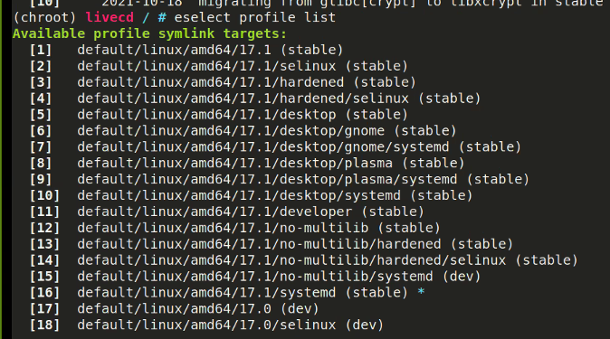

# October 21st 2021

## Mounting the boot partition

Last meeting we created a new environment that we entered. Now that we are in this new environment we need to mount the boot partition. To mount the boot partition type:

`mount /dev/sda1 /boot`

## Configuring Portage

### Installing a Gentoo ebuild repository snapshot from the web

Now that you have mounted the boot partition you can install a snapshot of the Gentoo ebuild repo. You can use `emerge-webrsync` to fetch the latest snapshot from one of the Gentoo mirrors. Then install it on the system. Type:

`emerge-webrsync`

## Reading news items

When the Gentoo ebuild repository is synchronized, Portage may output informational messages. These may look like:

```bash
* IMPORTANT: 2 news items need reading for repository 'gentoo'.
* Use eselect news to read news items.
```

Once you see this notice you can run:
` eselect news read`

## Choosing the right profile

A profile is the building block for Gentoo systems. It specifies default values for USE, CFLAGS, and other variables. It will also lock the systen to a certain range of package versions.

To see what profile the system is currently using type:

`eselect profile list`

You should see a list of available symlink targets.

We used #7 `default/linux/amd64/17.1/desktop/gnome/systemd (stable)`


To select number 7 for the system type:
`eselect profile set 7`

You can use
`eselect profile list`
to confirm that there is a star `*` on the #7 profile.

## Updating the @world set

Next we update the system's @world set to establish a base.
This step is necessary. Once updated the system will be able to apply any updates or USE flag changes. To update type:

`emerge --ask --verbose --update --deep --newuse @world`

**What are USE flags?**
USE flags are are a core feature of Gentoo. They are used to control optional dependencies and/or settings that a user may want to select.

## Configuring the USE variable

`emerge --info | grep ^USE`

A full description on the available USE flags can be found on the system in `/var/db/repos/gentoo/profiles/use.desc.`
To see them type:

`less /var/db/repos/gentoo/profiles/use.desc`

## Timezone

Next we select a timezone for our system. You can see what timezones are available wtih:
`ls /usr/share/zoneinfo`

Since we are using Systemd we will generate a symbolic link with:
`ln -sf ../usr/share/zoneinfo/America/Denver /etc/localtime`

**Note:** Replace America/Denver with your local timezone.

## Configure locales

Locales are used to specify the preferred language that the user should use. It also specifies the rules for sorting strings and displaying dates/times.

You define the system locals in the /etc/locale.gen file.

Use this command to generate all locales specified in the /etc/locale.gen file:
`locale-gen`

Then select the locale with:

`eselect locale set 4`

You can replace 4 with your preferred locale. We set the locale to 4 which was en_US.utf8 on our system.

Now reload the environment with:
`env-update && source /etc/profile && export PS1="(chroot) ${PS1}"`
