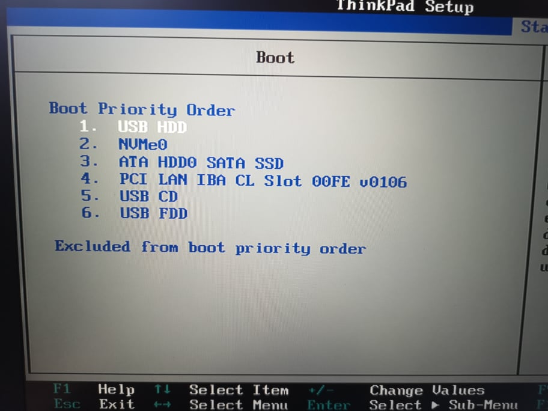

# August 19 2021

## Steps for day 1:
### Download
Go to the the [downloads](https://www.gentoo.org/downloads/) page on Gentoo Under **amd64 aka x86-64, x64, Intel 64**
download the Minimal Installation CD 

> x86-64 is a 64-bit version of the x86 instruction set, first released in 1999. It provides more virtual and physical memory than was previously possible with 32-bit predecessors.

To flash the .ios file to an empty USB drive download [BalenaEtcher]( https://www.balena.io/etcher/).

In the Balena Application:
1. click `Flash from File`.
Choose the downloaded file.

2. Click `Select Target`
and select your usb drive.

3. Click Flash

> 💡 A **removable volume** = is a form of computer storage that is designed to be inserted and removed from a system like a usb flash drive.

### Setting up our BIOS:

> **BIOS:** Basic Input/Output System
basic fundamentals of a computer

When you start your computer BIOS is the first software that runs. 

It can identify, test, and configure your computer's hardware and connect it to your operating system.

**Note:** This is called the BOOT process.

**UEFI** ( Unified Extensible Firmware Interface) is similar to BIOS but has other advantages. 
May be something we want to take some time to talk about async. 

In BIOS we:
- Set our date and time in the Date/Time tab.
- In the Security tab we navigated to the `Secure Boot` menu and disabled Secure Boot.

**Look up Secure boot and why it is needed**
- Also in the Security tab we navigated to the `Virtualization` menu and enabled `Intel (R) Virtualization technology` and `VT-d Feature`
- In the Startup tab we navigated to the `Boot` menu and changed the Boot Priority Order.
  1. USB HDD is top priority

To Exit out of the BIOS navigate to the Restart tab and choose `Exit Saving Changes`.
Alternative way to exit and save is to press `F10`

### Next Steps
From here you can try booting your ThinkPad with the USB flash drive. 

When you want to exit type `shutdown` to shutdown the computer and remove usb drive. 

## Other Notes:
Joe mentioned PXE Booting. 
Here is [a link](https://en.wikipedia.org/wiki/Preboot_Execution_Environment) to more info.

More on Secure Boot at
[Microsoft's docs](https://docs.microsoft.com/en-us/windows-hardware/design/device-experiences/oem-secure-boot)
