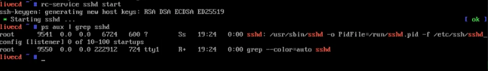

# August 23rd 2021

Steps for day 2:
During our first meeting we set up our Boot Priority Order in BIOS. Because we set USB HDD to the first priority our system will choose to use the USB drive with Gentoo to boot up.  
Once booted you should see a similar screen on your computer:


> Linux Fun Fact: The number of penguins you have at the top of your screen corresponds to the number of processors (CPU) cores on your machine.

**Note:** Linux ISO is used to boot Gentoo.
An ISO file is an archive file that typically contains the complete image of a CD or DVD.

1. After booting up Gentoo, type the `whoami` command to confirm you are the `root` user.
   You can also type `id`.

2. Next create a new password for the `root` user with the `passwd` command. Pick a strong password that is different from your main user password.
3. to start a service we run the `rc-service sshd start`
4. Now type `ps aux |grep sshd`
   
5. type `ifconfig`
   
6. Type `net-setup <interface name>`
   You should see a pop up that says Interface Details:
   
7. Where the pop-up asks "Is this the interface that you wish to configure" hit `Yes`
8. Hit `OK` for "My network is wired"
   
9. Hit `OK` for "Use DHCP to auto-detect my network settings" This will make it so that your system will auto assign an IP address and you do not have to set one up manually.
   
10. type `ifconfig` again in your terminal.
    You should see an inet with your IP address.
    
11. type `cat /etc/resolve.conf`.

- This [command](https://bash.cyberciti.biz/guide//etc/resolv.conf) is used to configure name servers.
- The file `/etc/resolv.conf` contains information that is read by the resolver routines the first time they are invoked by a process.
- Sample output:

```bash
nameserver 192.168.122.1
```

12. Type `ping 8.8.8.8` (Google's nameservers) to see if have network.  
    Type `Ctrl+C` to stop sending packets
    
13. On your other computer (Mac for Juliana and I) type `ssh root@<the IP address you saw with inet>
    

You can now move your computer running Linux closer to your router if needed.

Take time to try this all over again and see if you can connect to your network.

### Homework Read:

Configure the network:
https://wiki.gentoo.org/wiki/Handbook:AMD64/Installation/Networking

Partition the Disk:
https://wiki.gentoo.org/wiki/Handbook:AMD64/Installation/Disks

### Defining Terms and Commands:

- **DHCP**- Dynamic Host Configuration Protocol
  [Here is a video](https://youtu.be/e6-TaH5bkjo) on DHCP I found really helpful.
- **whoami**: A command that displays the name of the user who is logged-on.
  If you are the root user it will display root.
  
  **Note:** if you see the # sign in your command it means you are the root user.
- **id:** A command is used to find out user and group names and numeric ID's
  Example:
  
- **passwd:** A command that changes passwords for user accounts.
  If you have a weak password you may be prompted to create a stronger one.
  **Note:** You should not have your the same password for your `root` password and `user` password.
- **rc-service:** locates the specified service and runs it with the given arguments
- **sshd:** stands for "OpenSSH SSH daemon". It is used for secure encrypted communications between two untrusted hosts over an insecure network or internet
- **ps:** a command that reports a snapshot of the current processes. We used this in the `ps aux |grep sshd` command.
- **ifconfig:** command used to configure the kernel-resident network interfaces. It is run at boot time.
- **[ps aux command](https://www.computernetworkingnotes.com/linux-tutorials/ps-aux-command-and-ps-command-explained.html)** options:
  **a**:- This option prints the running processes from all users.
  **u:**- This option shows user or owner column in output.
  **x**:- This option prints the processes that have not been executed from the terminal.
- **grep:** Grep is command-line tool used to search for a string of characters in a specified file
- **inet:** Internet protocol family.
  The `inet` in `ifconfig` output is an [address family](https://man7.org/linux/man-pages/man8/ifconfig.8.html#Address_Families)
- **cat:** command used to concatenate files and display on your screen.
