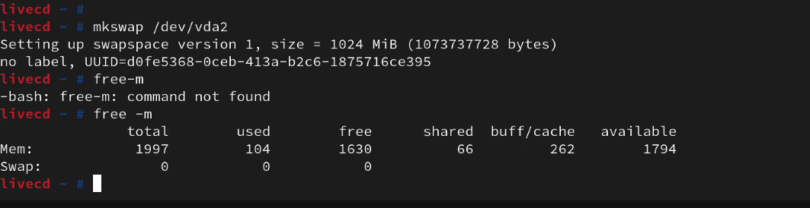

**These notes or a WIP**

# September 16th 2021

## Applying a filesystem to a partition

Most popular filesystem is extended file system (ext).

It started with ext2 and now we are on ext4.

[XFS](https://en.wikipedia.org/wiki/XFS) is another popular filesystem.

Home Work: [EFI systems](https://en.wikipedia.org/wiki/EFI_system_partition)

Step 1:
Type:
`mkfs.vfat -F 32 /dev/sda1`

Then type:
`mkfs.ext4 /dev/sda3`

journal: helps with transactions on the disk

Linux Swap: If you are running out of RAM linux system will check what hasn't been used in a long time and swap it out.

## Activating the swap partition

`mkswap` is the command that is used to initialize swap partitions. Type:

`mkswap /dev/sda2`

https://www.linuxatemyram.com/

Type: `swapon /dev/sda2` to turn on Swap.

`free -m` shows free memory and swap.

## Mounting the root partition

Once the partitions are intialized you need to mount them.
You can use the `mount` command` You need to create mount directories for every partition created.

To mount the root partition type:
`mount /dev/sda3 /mnt/gentoo`

To see the free disk space use:
` df -h`

`df` reports the available space and file slots for file systems where user has read access.
`-h` is for human readable

**What does `inode` mean ?**

[From Geek University:](https://geek-university.com/linux/inode/#:~:text=An%20inode%20is%20a%20data,file%20when%20it%20is%20created.)
_"An inode is a data structure that stores various information about a file in Linux, such as the access mode (read, write, execute permissions), ownership, file type, file size, group, number of links, etc. Each inode is identified by an integer number. An inode is assigned to a file when it is created."_

- `pwd`: command that shows the current path
- `cd ..`: will go up one directory
- `ls -la`: list long format including hidden files
- `umount`: Note the command is `umount` and not “unmount.” used to unmount a mounted file system.
- `tmpfs:` is a file system which keeps all of its files in virtual memory
- `ro`: Mounted as Read Only
- `rw`: Mounted as Read/Write

**Tarball:** A Tarball is a commonly used name to refer to an archive file in the tar (Tape Archive) format

## Setting the Date and Time

Before you install Gentoo you should have your date and time set correctly.
To verify current date and time use the `date` command.

Type: `date`

If your date is wrong you can update it automatically with :
`ntpd -q -g`

(The Network Time Protocol daemon (ntpd))

## Choosing a stage tarball

Choosing a base tarball for the system can save a considerable amount of time later on in the installation process, specifically when it is time to choose a system profile.

There are different types. You can use [OpenRC](https://wiki.gentoo.org/wiki/OpenRC).

We are going to use [systemd](https://wiki.gentoo.org/wiki/Systemd)

We used the `links` command to browse the Gentoo mirror list to find a stage tarball to download.

Type `links https://www.gentoo.org/downloads/mirrors/`

To verify the files type:

`gpg --verify stage3-amd64-<release>-<init>.tar.?(bz2|xz){.DIGESTS.asc,}`

Validate:
https://www.gentoo.org/downloads/signatures/
