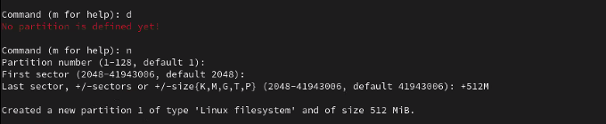
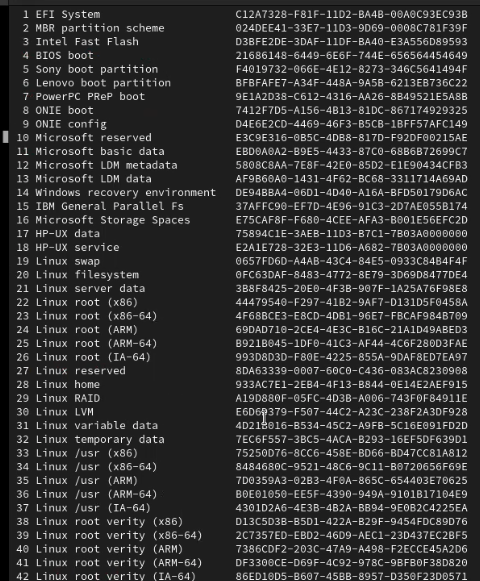
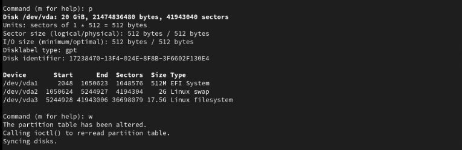

# September 9th 2021

## Preparing the Disk

[Gentoo Handbook](https://wiki.gentoo.org/wiki/Handbook:AMD64/Installation/Disks)

**Block device:**
A kind of file that represents a device with data that can be read or written to it with blocks.
Examples of block devices are:

- hard disks
- CD-ROMS
- Floppy disks

Files we viewed:
`/dev` is your filesystem representation of devices your system understands - providing a mechanism for applications to access data on the device without needing to know specifically what the device is.

`sd` is for (originally) scsi disk devices, however it seems to now refer to removable devices in general and SATA devices

and the letter is just the number of the device, starting at `a`, with the number indicating the partition

## Partition Scheme

### Making the partitions

In Fedora OS and other Linux distributions the partitions are created for you. In Gentoo we will create them manually.

`ip a s`:

`fdisk -l /dev/vda` lists out the virtualized disk on Mac's computer.
`fdisk -l /dev/sda` lists out the disks on your computer.

## Partition the Disks

Type `fdisk /dev/sda`
This says we want to operate this disk on this drive.

Next type:
`p` command for print.
This will print out the disk's current partition configuration.
Example:

```shell
Disk /dev/sda: 476.94 GiB 512110190592 bytes, 100002151216 sectors
Disk model: Sata SSD
Units: sectors of 1 * 512 = 512 bytes
Sector size (logical/physical): 512 bytes / 512 bytes
I/O size (minimum/optimal): 512 bytes / 512 bytes
Disklabel type: dos
Disk identifier: 0x2b7ccd39
```

**Note:** If you see Device at the bottom and something like:

```shell
Device        Start      End  Sectors  Size Type
/dev/sda1      2048   526335   524288  256M EFI System
```

this means you already have some partitions set up.

Type:
`g`: This creates a new GPT disklabel and should output something like:

```shell
Created a new GPT disklabel (GUID: 87EA4497-2722-DF43-A954-368E46AE5C5F)
```

Then hit `p` again and you should see the disk.

```shell
Disk identifier: 09963102-86DB-F048-668F2B6609E1
```

**Note**: If you have Windows as an operating system you may see an erro that says:

```shell
This device contains 'dos' signature and it will be removed by a write command. See fdisk(8) man page and -wipe options for more details.
```

If you are creating new partitions you will be removing the Windows partition.

## Create a New Partition

Type `n`: This command will create a new partition.

Hit `enter` to select the default partition number.

Hit `enter` to select the default sector.

Type `+512m` to give the last sector a size.



**Note:** If you have Windows on your operating system you may see an error that says;

```shell
Partition #1 contains a nfs signature.

Do you want to remove the signature? [Y]es/[N]o?
```

Type yes to remove the signature.

Type: `t` - This will select a partition.

Type:`L`- This will list out all of the different partition types.


Exit out of the list by typing `q` and hitting enter.

Type `1` to select the EFI system.
This will

[EFI System](https://en.wikipedia.org/wiki/EFI_system_partition).

## Set up Swap Partition

`Swap space` is the portion of virtual memory that is on the hard disk, used when RAM is full.

Type `n` for a new partition to create the swap partition.

It will default to `2`. Hit `enter` for the default.

For the `First sector` hit `enter` to have the default settings. `

For the `Last sector`
in general you give half the size of ram to your swap partition.
For Juliana and I it will be `+8G` since we have 16G.

```shell
Partition number( 2-128, default 2):
First sector(1050624-1000215182, default 1050624):
Last sector, +/-sectors or +/-size{K,M,G,T,P} (1050624-1000215182, default 1000215182): +8G
```

You should see a newly created partition:

```shell
Created a new partition 2 of type 'Linux filesystem' and of size 8 GiB.
```

Type `t` to change from Linux filesystem to Linux Swap.

Select partition 2 to change
then type 19 or the alias `swap` to change the partition to to Linux Swap.

```shell
Command (m for help):t
Partition number (1,2, default 2): 2
Partition type (type L to list all types): 19

Changed type of partition 'Linux filesystem' to 'Linux swap'.
```

Type `p` to see you new devices:

```shell
Device       Start   End      Sectors Size   Type
/dev/sda1     2048   1050623  1048576 512M  EFI System
/dev/sda2   1050624  17827839 16777216 8G   Linux swap
```

## Create Root Partition

Type `n` to create a new partition.
Then type `3` to create the third partition.

For the First sector, hit `Enter`.

For the Last sector, hit `Enter` to create a partition that takes up the rest of the remaining space on the disk.

Type `p` to display the partition table that looks similar to this:



To save the partition layout and exit fdisk, type `w`.

To see you current partition scheme you can type:

`fdisk -l /dev/sda`
